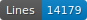

# CORSAIR-FR-PRINT-16

   

## Content

## How to cite

Cf. [`htr-united.yml`](https://github.com/CORSAIR-La-Popeliniere/segmentation_training_02.25/blob/main/htr-united.yml) file.

## Licences
Annotation is CC-BY. Images belong to Gallica.

 